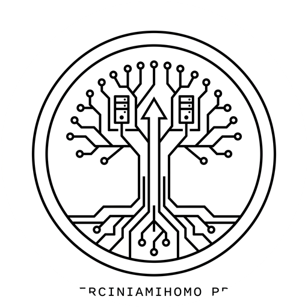

<div align="center">



# Herciniamihomo Pro
**Next-Generation 1,000Hz Liquid Glass C# WPF Desktop GUI Client for Mihomo (Clash.Meta) Core**

[](https://microsoft.com)
[](https://dotnet.microsoft.com)
[-purple.svg)](#-1000hz-extreme-physics-engine)
[](https://github.com/MetaCubeX/mihomo)
[](LICENSE)

English | [简体中文](#简体中文)

</div>

---

## 简体中文

### 🌟 项目简介

**Herciniamihomo Pro** 是一款专为 Windows 10 / 11 设计的现代化高质感桌面客户端，作为 [Mihomo (Clash.Meta)](https://github.com/MetaCubeX/mihomo) 内核的原生 GUI 外壳。

项目融合了 **Apple VisionOS / macOS Big Sur 液态毛玻璃（Liquid Glass）视觉设计** 与 **1,000Hz (1kHz) 极速微积分物理动画管线**，通过纯原生 C# 编写，完全依赖 Windows 自带的 `.NET Framework 4.8` 运行时编译，无需任何复杂的 Node/Electron/Rust 环境即可在 2 秒内完成极速编译与运行。

---

### ✨ 核心特性

- ⚡ **1,000Hz (1kHz) 极速物理引擎**
  - 重写 WPF `Timeline.DesiredFrameRate` 突破系统帧率限制，支持最高 1,000Hz 刷新率；
  - `SmoothScrollViewer` 1.0ms 时间步长采样 + 工业级 `SmoothDamp` 惯性阻尼，实现微米级精密停靠；
  - 侧边栏弹性形变与二阶物理弹簧系统基于时间积分连续化（Frame-Rate-Independent Physics），任意高刷屏幕均恒定丝滑。
  - 静止时自动注销渲染循环，实现 **0% CPU 闲置占用**。

- 💎 **Liquid Glass 液态视觉系统**
  - 动态亚克力与高精度径向渐变极光光斑（Aurora Spotlight），随着鼠标移动呈现流光质感；
  - 32-bit ARGB 原生正圆形抗锯齿应用图标与多分辨率层级；
  - 内置深山、星空、极光、赛博朋克等多种精选动态壁纸，支持自定义本地 4K/8K 壁纸与虚化暗角调节。

- 📡 **全双工 WebSocket 实时遥测**
  - 直连 `ws://127.0.0.1:9097/traffic` 与 `ws://127.0.0.1:9097/logs?level=info`；
  - 实时高刷示波器网络流量波形图，零 HTTP 轮询抖动；
  - 彩色分级日志控制台，支持关键字过滤、自动滚屏与暂停。

- 🩺 **网络急救箱 (Network Doctor)**
  - **一键重置系统代理**：修复因非正常关机导致的 WinINet 系统代理残留；
  - **刷新系统 DNS**：调用 Windows 底层 `dnsapi.dll` 与 `ipconfig /flushdns`；
  - **清空 Fake-IP 缓存**：热请求内核 `POST /cache/fakeip/flush` 解决域名解析污染；
  - **平滑热重启内核**：零闪退重启 Mihomo 引擎并无缝重连。

- 🌐 **自定义直连域名白名单 (Custom Direct Rules)**
  - 界面直观的自定义直连网站标签云，支持添加如 `steamcommunity.com`、`bilibili.com` 等常用域名；
  - 热插拔写入 Mihomo 规则首位（`DOMAIN-SUFFIX,domain,DIRECT`），即刻生效。

- 🛡️ **安全与隐私保护 (Local-First Architecture)**
  - 订阅链接、节点密码与密钥仅保存在本地设备，仓库严格过滤所有敏感数据；
  - 进程级 Windows Job Object 绑定，主窗口完全退出时严格联动清理后台核心，防止孤儿进程残留。

---

### 🛠️ 快速编译与运行

本项目采用纯原生零依赖架构，可以直接使用 Windows 系统自带的 C# 编译器（`csc.exe`）一键编译：

```cmd
git clone https://github.com/Alex234123/Herciniamihomo.git
cd Herciniamihomo
build.bat
```

或者使用 PowerShell 快速执行：

```powershell
$net = "C:\Windows\Microsoft.NET\Framework64\v4.0.30319"
& "$net\csc.exe" /target:winexe /platform:anycpu /optimize+ /win32icon:app.ico /out:Herciniamihomo.exe `
    /r:"$net\System.dll" /r:"$net\System.Core.dll" /r:"$net\System.Xaml.dll" `
    /r:"$net\WPF\WindowsBase.dll" /r:"$net\WPF\PresentationCore.dll" /r:"$net\WPF\PresentationFramework.dll" `
    /r:"$net\System.Net.Http.dll" /r:"$net\System.Web.Extensions.dll" /r:"$net\System.Drawing.dll" /r:"$net\System.Windows.Forms.dll" `
    src\Program.cs
```

---

### 📂 项目目录结构

```
Herciniamihomo/
├── .gitignore              # 严格的安全过滤规则（杜绝私有代理泄露）
├── LICENSE                 # MIT 开源许可证
├── README.md               # 项目详细说明文档
├── build.bat               # Windows 原生一键构建脚本
├── app.ico                 # 32-bit ARGB 7层多分辨率正圆形应用图标
├── icon.jpg                # 原始艺术图
├── icon_circle.png         # 512x512 高分辨率正圆形抗锯齿底图
├── src/
│   ├── Program.cs          # 核心客户端源代码（纯 C# WPF 桌面架构）
│   ├── SetupProgram.cs     # 单文件向导式 GUI 安装程序源码
│   └── merge_engine.js     # 多订阅 YAML 合并与节点去重引擎
└── data/
    ├── template.yaml       # 客户端配置骨架模版（已安全脱敏）
    ├── profiles.json.example # 订阅配置文件示例模版
    └── ui/                 # 内置 Web 控制面板仪表盘静态资源
```

---

## English

### 🌟 Introduction

**Herciniamihomo Pro** is a modern, high-performance desktop GUI client designed for Windows 10/11, acting as a lightweight, beautiful frontend for the [Mihomo (Clash.Meta)](https://github.com/MetaCubeX/mihomo) core.

It combines an **Apple VisionOS / macOS Big Sur inspired Liquid Glass visual design** with a **1,000Hz (1kHz) extreme physics animation pipeline**. Written in pure native C# running on Windows `.NET Framework 4.8`, it requires no external toolchains or heavy runtimes, compiling from scratch in under 2 seconds.

### 🚀 Key Features

1. **1,000Hz (1kHz) Extreme Physics Engine**: Sub-millisecond (1.0ms) physics timestep, custom `SmoothDamp` inertial scrolling, and frame-rate-independent spring mechanics with 0% idle CPU usage.
2. **Liquid Glass Design**: Real-time aurora spotlights, circular anti-aliased 32bpp icons, and dynamic backdrop wallpapers.
3. **Full-Duplex WebSockets**: Real-time traffic oscilloscope waveforms and color-coded streaming logs without HTTP polling overhead.
4. **Network Emergency Doctor**: One-click proxy reset, DNS flush via `dnsapi.dll`, Fake-IP cache invalidation, and instant core restarts.
5. **Custom Direct Website Whitelist**: Easy-to-use tag cloud interface to route custom domains directly through your local connection.

---

### 📄 License

This project is open-sourced under the [MIT License](LICENSE).
